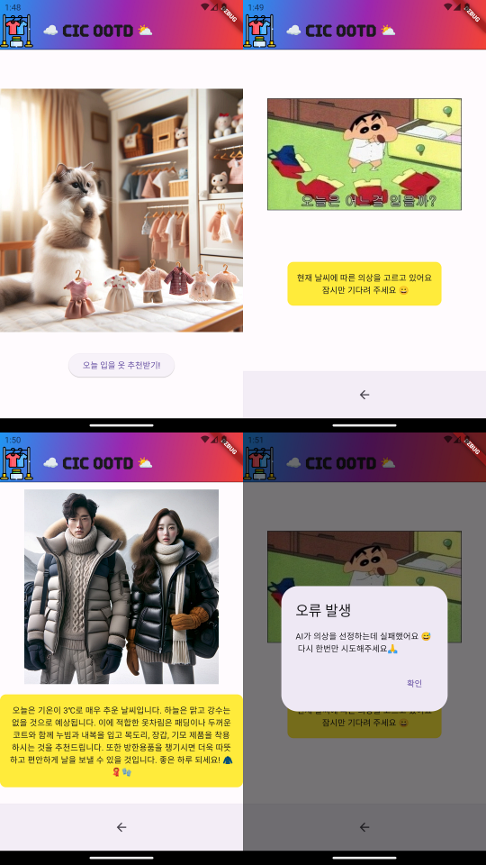

# 📌Intro.
- AIFFEL 7th 의 Flutter 을 배우는 과정의 마지막 Main Quest로 차후 AIFFELthon에 제안할 아이디어를 구현해봅니다.
- 이를 위해 앱의 구성을 기획하고, 기획한 내용대로 Flutter를 사용해 앱을 구현합니다.
- (optional) 그리고, 가능하다면 fastAPI를 통해 구상한 기능을 앱과 연동합니다.

---

# CIC OOTD 앱 설명 및 작동과정 가이드

- 이 프로젝트는 Flutter와 FastAPI를 사용하여 현재 날씨에 맞는 옷차림을 추천하는 앱입니다.

## 기능

- 현재 날씨 정보에 기반한 옷차림 추천
- 온도별 옷차림 시각화 (차후 구현 예정, 현재는 사전에 stable diffusion으로 생성된 이미지를 날씨정보에 맵핑하여 사용)

## 👉 앱 구동 이미지 예시


---

### 실제 이미지 구동과정 (정상 작동) 🙆‍♀️


### 실제 이미지 구동과정 (오류 발생) 🙅‍♀️


---

## ⚙ 기술 스택 ⚙

- 프론트엔드: Flutter
- 백엔드: FastAPI
- 배포: Heroku

## 설치 및 실행 방법

### 사전 요구 사항

- Flutter
- Python
- 필요한 Python 패키지: FastAPI, Uvicorn, Requests, python-dotenv, OpenAI

### 설치 절차

1. 저장소 클론:
   ```bash
   git clone https://github.com/your-repository/flutter-fastapi-clothes-recommendation.git
   ```
2. 프론트엔드 의존성 설치:
   ```bash
   cd flutter-fastapi-clothes-recommendation/flutter_app && flutter pub get
   ```
3. 백엔드 의존성 설치:
   ```bash
   cd ../fastapi_app && pip install -r requirements.txt
   ```

### 실행 방법

- 백엔드:
  ```bash
  uvicorn main:app --reload
  ```
- 프론트엔드:
  ```bash
  flutter run
  ```

## 앱 사용 방법

1. 앱을 실행하면 첫 화면에서 '오늘 입을 옷 추천받기!' 버튼을 볼 수 있습니다.
2. 이 버튼을 클릭하면 앱은 사용자의 현재 위치를 기반으로 날씨 정보를 조회합니다. (현재는 위치 기반 서비스는 구현되지 않았고, 고정된 위치를 사용합니다. 차후 AIFFELthon에서는 기능 구현이 필요합니다.)
3. 날씨 정보에 따른 옷차림 추천을 받기 위해, 앱은 내부적으로 FastAPI 백엔드 서버에 HTTP 요청을 보냅니다.
4. 백엔드 서버는 현재 날씨 정보와 온도에 기반한 옷차림을 추천하고, 이 정보를 Flutter 앱으로 응답합니다.
5. 앱은 받은 추천 정보를 사용자에게 시각적으로 표시합니다. 이때, 온도별로 다른 이미지를 보여주어 사용자가 추천받은 옷차림을 쉽게 이해할 수 있도록 합니다.

## FastAPI와 Flutter 앱의 연계 작동 방식

1. **HTTP 요청**: 사용자가 '오늘 입을 옷 추천받기!' 버튼을 클릭하면, Flutter 앱은 FastAPI 백엔드 서버의 `/weather_recommendation` 엔드포인트로 HTTP GET 요청을 보냅니다. 이 요청은 사용자의 현재 위치 정보를 포함할 수 있으나, 현재 예제 코드에는 구현되어 있지 않습니다.

2. **날씨 정보 처리**: FastAPI 백엔드 서버는 요청을 받으면, 외부 날씨 정보 API를 호출하여 현재 날씨 데이터를 가져옵니다. 가져온 날씨 데이터는 온도, 강수 확률, 습도 등을 포함합니다.

3. **옷차림 추천**: 서버는 날씨 데이터를 분석하여 현재 온도에 적합한 옷차림을 결정합니다. 옷차림 추천은 사전에 정의된 온도별 옷차림 정보를 바탕으로 합니다.

4. **응답 생성**: 추천된 옷차림 정보와 함께, FastAPI 서버는 GPT-3을 사용하여 사용자 친화적인 추천 문장을 생성합니다. 이 문장은 현재 날씨 상황과 추천 옷차림을 설명합니다.

5. **Flutter 앱으로 응답 전송**: 생성된 추천 문장과 옷차림 정보는 JSON 형식으로 Flutter 앱에 응답으로 보내집니다.

6. **사용자 인터페이스 업데이트**: Flutter 앱은 받은 응답을 파싱하여 사용자에게 추천 옷차림과 함께 날씨 상황을 설명하는 문장을 보여줍니다. 온도에 따라 다른 이미지를 표시하여, 사용자가 추천받은 옷차림을 더 잘 이해할 수 있게 합니다.

## FastAPI와 Flutter 앱 연계 작동 방식

- 사용자 요청에 따라 Flutter 앱은 FastAPI 백엔드로 HTTP GET 요청을 보냄
- FastAPI 백엔드는 날씨 정보 API를 호출, 데이터를 받아 옷차림을 추천하고 앱으로 응답
- 앱은 응답을 통해 사용자에게 옷차림을 시각적으로 표시


# Reference

- [기상청 OPen API](https://data.kma.go.kr/cmmn/main.do)
- [FastAPI](https://fastapi.tiangolo.com/)
- [개발자의 공부법! 파이썬 FastAPI 공식문서로 처음부터 공부하기](https://www.youtube.com/live/ZqSpl0Ic8ik?si=QntTuDySmxxEtz35)
- [How To Deploy FastAPI To Heroku](https://youtu.be/lzp6YvJMRL4?si=IoLGPliNTI5ocDOv)
- [코딩셰프-플러터(Flutter) 조금 매운맛🌶️ 강좌 14 | 날씨 앱(weather app) 만들기 2: JSON parsing(제이슨 파싱)](https://youtu.be/ccq1yCmNzdk?si=TySA7UEmcILLp3OD)